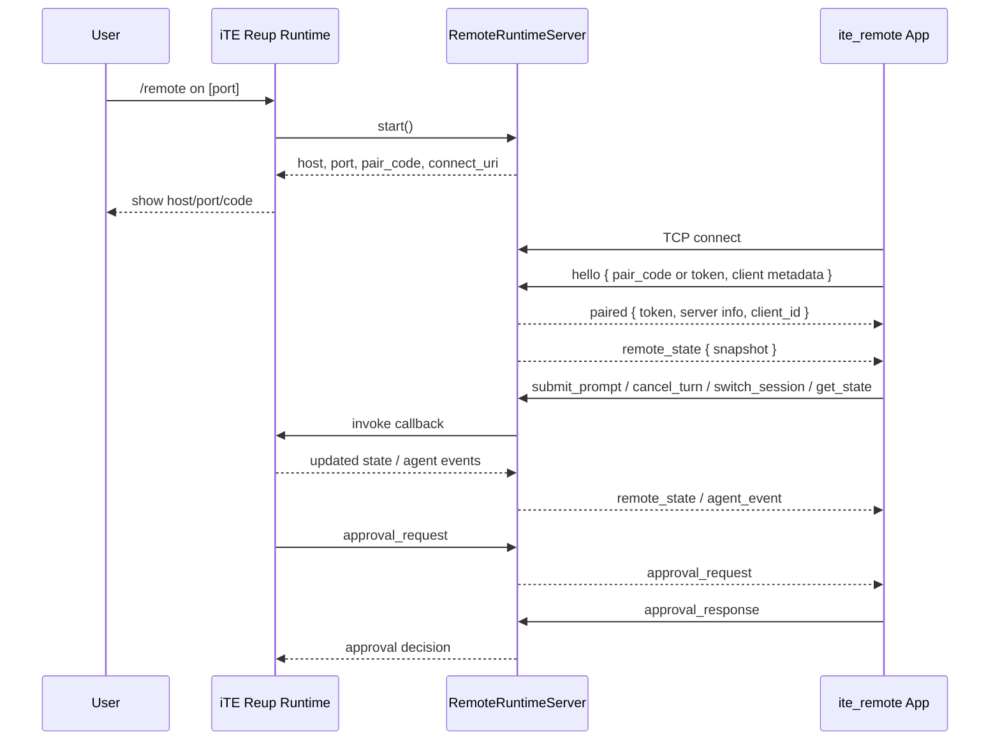

# iTE Remote Runtime Connection

This document explains how the iTE remote connection works at runtime, from the Python Reup app that exposes the session to the `ite_remote` app that connects to it.

## Short Version

iTE remote is a local-network bridge, not a cloud relay.

- The Reup runtime starts a plain TCP server.
- The remote app opens a raw socket to that host and port.
- Both sides exchange newline-delimited JSON frames.
- First connection uses a 6-digit pair code.
- Successful pairing returns a reconnect token.
- After that, the phone mostly stays in sync through:
  - full snapshots with `remote_state`
  - live deltas with `agent_event`
  - request/response commands like `submit_prompt`, `cancel_turn`, and `approval_response`

The important implication is that this is a direct LAN connection. There is no TLS, no WebSocket layer, and no external broker in the runtime path.

## Where The Code Lives

Python runtime side:

- [`src/ite/remote/server.py`](/Users/kiishidavid/Documents/Dev/Projects/ite/src/ite/remote/server.py)
- [`src/ite/remote/protocol.py`](/Users/kiishidavid/Documents/Dev/Projects/ite/src/ite/remote/protocol.py)
- [`src/ite/remote/uri.py`](/Users/kiishidavid/Documents/Dev/Projects/ite/src/ite/remote/uri.py)
- [`src/ite/ui/reup/app.py`](/Users/kiishidavid/Documents/Dev/Projects/ite/src/ite/ui/reup/app.py)

Flutter app side:

- [`ite_remote/lib/remote/repositories/remote_runtime_repository.dart`](/Users/kiishidavid/Documents/Dev/Projects/ite/ite_remote/lib/remote/repositories/remote_runtime_repository.dart)
- [`ite_remote/lib/remote/notifiers/remote_runtime_notifier.dart`](/Users/kiishidavid/Documents/Dev/Projects/ite/ite_remote/lib/remote/notifiers/remote_runtime_notifier.dart)
- [`ite_remote/lib/remote/models/remote_models.dart`](/Users/kiishidavid/Documents/Dev/Projects/ite/ite_remote/lib/remote/models/remote_models.dart)
- [`ite_remote/lib/remote/utils/connection_uri.dart`](/Users/kiishidavid/Documents/Dev/Projects/ite/ite_remote/lib/remote/utils/connection_uri.dart)
- [`ite_remote/lib/remote/screens/settings_sheet.dart`](/Users/kiishidavid/Documents/Dev/Projects/ite/ite_remote/lib/remote/screens/settings_sheet.dart)

## Mental Model

Think of the system as four layers:

1. Reup owns the real agent session and tool execution.
2. `RemoteRuntimeServer` exposes a narrow remote-control API over TCP.
3. The mobile app repository manages socket I/O and persistence.
4. The mobile notifier turns protocol frames into UI state.

That means the phone is not "running the agent." It is a remote control and live monitor for a runtime that still lives on the laptop.

## End-To-End Flow



## 1. How The Runtime Starts The Bridge

The `/remote` command is registered in [`src/ite/commands/remote.py`](/Users/kiishidavid/Documents/Dev/Projects/ite/src/ite/commands/remote.py), but the actual runtime behavior lives in Reup at [`src/ite/ui/reup/app.py`](/Users/kiishidavid/Documents/Dev/Projects/ite/src/ite/ui/reup/app.py).

When the user runs `/remote on`:

- Reup lazily creates `RemoteRuntimeServer`.
- It injects four callbacks into the server:
  - `state_provider=self._build_remote_runtime_state`
  - `submit_prompt=self._submit_remote_prompt`
  - `cancel_turn=self._cancel_remote_turn`
  - `switch_session=self._switch_remote_session`
- It then calls `start(port=...)`.

The runtime server itself is intentionally small. It does not know how to run the agent. It only knows how to:

- accept socket clients
- authenticate them
- forward commands into Reup callbacks
- broadcast state and event frames back out

## 2. What `RemoteRuntimeServer.start()` Actually Does

In [`src/ite/remote/server.py`](/Users/kiishidavid/Documents/Dev/Projects/ite/src/ite/remote/server.py):

- The server binds with `asyncio.start_server(...)`.
- Default host is `0.0.0.0`, so it listens on all interfaces.
- Default port is `0`, so the OS may choose a free port.
- After bind, the server records:
  - actual host
  - actual port
  - a "display host" for humans to use

The display host is chosen by:

- trying to infer the outbound LAN IP via a UDP connect to `8.8.8.8`
- falling back to hostname-based IPv4 lookup
- filtering out loopback, multicast, link-local, and unspecified addresses
- preferring private LAN addresses

This is why the CLI can tell the user something like:

```text
Host: 192.168.x.x:9123
Pair code: 123456
Connect URL: ite:///c/192.168.x.x/9123/123456
```

## 3. Pair Code And Reconnect Token

The auth model is lightweight and local:

- A fresh pair code is generated by `regenerate_pair_code()`.
- It is always a 6-digit numeric string.
- It expires after 10 minutes.

Important detail:

- the pair code is for first-time pairing
- a successful pairing issues a random client token
- later reconnects can use the token instead of the pair code

Server behavior during handshake:

1. The first client frame must be `hello`.
2. The payload may contain:
   - `pair_code`
   - `token`
   - `client_name`
   - `platform`
3. The server authenticates if either:
   - the token is already in the in-memory token set, or
   - the pair code matches the current unexpired code
4. If pairing used the pair code, the server mints a new token and returns it.

That token is only stored in memory on the Python server. So:

- reconnect survives app restarts on the phone, because the phone stores the token in shared preferences
- reconnect does **not** survive a runtime/server restart, because the server token set is lost

## 4. The Wire Format

The transport is plain TCP with line-delimited JSON.

Each frame looks like this shape:

```json
{
  "type": "remote_state",
  "payload": { "...": "..." },
  "request_id": "optional"
}
```

Observations:

- There is no HTTP upgrade.
- There is no WebSocket framing.
- There is no binary protocol.
- Frames are separated by `\n`.
- The Flutter app decodes with `utf8 -> LineSplitter`.

On the server side, `_send()` serializes a JSON object and appends a newline. On the app side, `RemoteRuntimeRepository` reads one line at a time and converts it into `RemoteFrame`.

## 5. Supported Frame Types

### App to runtime

- `hello`
- `ping`
- `get_state`
- `submit_prompt`
- `cancel_turn`
- `switch_session`
- `approval_response`

### Runtime to app

- `paired`
- `pong`
- `remote_state`
- `agent_event`
- `approval_request`
- `approval_resolved`
- `command_ack`
- `error`

This is a narrow control-plane protocol. It is not a general-purpose sync engine.

## 6. Initial Sync: `paired` Then `remote_state`

After authentication succeeds, the server sends two important frames immediately:

1. `paired`
2. `remote_state`

`paired` gives the app:

- the long-lived reconnect token
- server connection info
- a generated `client_id`

`remote_state` gives the app a full snapshot of the current runtime state, including:

- current session id and title
- workspace path
- model name
- whether a turn is running
- whether the last turn had an error
- open sessions
- a compact transcript

This is the foundation of the remote UX:

- snapshots make the app recoverable and easy to reconnect
- live events add immediacy without forcing the app to rebuild the whole state from deltas alone

## 7. What Goes Into `remote_state`

Reup builds the snapshot in `_build_remote_runtime_state()` inside [`src/ite/ui/reup/app.py`](/Users/kiishidavid/Documents/Dev/Projects/ite/src/ite/ui/reup/app.py).

It packages:

- app metadata: `{"name": "iTE", "surface": "reup"}`
- `current_session`
- `open_sessions`
- `transcript`

The transcript is not the full raw conversation history. It is a compact remote-friendly export built by:

- `ContextManager.export_transcript_state()` in [`src/ite/context/manager.py`](/Users/kiishidavid/Documents/Dev/Projects/ite/src/ite/context/manager.py)
- `build_remote_transcript()` in [`src/ite/remote/protocol.py`](/Users/kiishidavid/Documents/Dev/Projects/ite/src/ite/remote/protocol.py)

That compaction layer matters:

- max transcript messages: `80`
- max text chars per entry: `2400`
- tool call arguments are trimmed
- system messages are dropped

So the phone gets a useful summary, not an unbounded session dump.

## 8. Live Updates: `agent_event`

Snapshots are not enough during an active turn. Reup also forwards live agent events through `_broadcast_remote_agent_event(...)`.

Those events originate from the normal agent runtime loop. Reup handles each `AgentEvent`, then mirrors it to the remote bridge using `serialize_agent_event(...)`.

Important event types exposed remotely:

- `agent_start`
- `text_delta`
- `text_complete`
- `tool_call_start`
- `tool_call_progress`
- `tool_call_complete`
- `agent_error`
- `loop_detected`
- `context_compacting`
- `context_compacted`

The remote app uses them for three different UI views:

- activity feed
- live tool feed
- incident/error feed

That is why the remote UI feels "live" even though the authoritative state still lives on the laptop.

## 9. Command Path: Remote App To Reup

The remote app can issue a small set of commands.

### `submit_prompt`

Flow:

1. User types on phone.
2. Flutter notifier calls repository `submitPrompt(...)`.
3. Repository sends `submit_prompt`.
4. Server calls the injected `submit_prompt` callback.
5. Reup converts that into a normal turn payload and dispatches it.

Meaning: remote prompting is not a special execution mode. It enters the same turn machinery the local UI uses.

### `cancel_turn`

Flow:

1. App sends `cancel_turn`.
2. Server calls `cancel_turn` callback.
3. Reup cancels the active turn if one is running.

### `switch_session`

Flow:

1. App sends `switch_session {session_id}`.
2. Server calls `switch_session` callback.
3. Reup activates that session.
4. If the switch succeeds, Reup publishes fresh remote state.

## 10. Approval Round-Trip

One of the most important runtime behaviors is remote approval handling.

When the runtime needs user confirmation for a tool action, Reup's `confirmation_callback(...)` checks whether:

- the remote server is running
- at least one authenticated remote client is connected

If yes, it prefers the phone as the approval surface.

Flow:

1. Reup creates an approval payload with:
   - request id
   - tool name
   - description
   - command
   - diff
   - session id
2. `RemoteRuntimeServer.request_approval(...)` stores a future in `_approval_requests`.
3. The server broadcasts `approval_request`.
4. The phone shows the approval UI.
5. The phone sends `approval_response { request_id, approved }`.
6. The server resolves the waiting future.
7. Reup continues based on that decision.

If no remote client is available, Reup falls back to its local modal confirmation flow.

This is a good example of the design: remote is optional, but when available it can become the live control surface.

## 11. Reconnect Behavior

The Flutter app stores these values in shared preferences:

- host
- port
- pair code
- token

On screen initialization, the notifier tries to reconnect automatically when it already has host and port.

The effective reconnect story is:

- same runtime session still alive: token-based reconnect should work
- runtime server restarted: token no longer valid, new pair code required
- network changed: user must reconnect to the new host/port

## 12. Connection URI Behavior

The runtime generates a connection URI like:

```text
ite:///c/<host>/<port>/<pair_code>
```

That URI is the one actually used by the runtime when it prints connection info.

Notable detail:

- the Python runtime can also parse `ite://connect?host=...&port=...&code=...`
- the Flutter parser mainly supports:
  - `ite:///c/host/port/code`
  - `ite://c/host/port/code`
  - `host:port:code`
  - `ite-remote://host:port/code`

So the simple path-based URI is the real runtime-to-app happy path.

## 13. Security And Trust Model

This part is important when explaining the feature accurately.

What the current implementation does:

- binds a plain TCP listener
- accepts LAN clients that know the host, port, and valid pair code or token
- tracks authenticated clients in memory
- exposes prompt submission, cancellation, session switching, and approval response

What it does **not** do:

- TLS encryption
- mutual auth
- account-based identity
- server-side persistence of tokens
- cloud relay or NAT traversal

Practical interpretation:

- this is best understood as a trusted local-network companion connection
- it is convenient and lightweight
- it is not designed like an internet-facing hardened remote-access service

## 14. Why The Design Works Well

Architecturally, the design is clean for this use case because it separates responsibilities:

- Reup remains the source of truth.
- The bridge protocol stays small.
- The app can reconnect from a full snapshot.
- Live events keep the experience responsive.
- Approval requests are modeled as explicit blocking round-trips.

That gives iTE remote a good balance:

- simple enough to reason about
- good enough for live control on the same network
- not overbuilt with unnecessary transport layers

## 15. A Simple Way To Explain It To Other People

If you need the 30-second explanation, use this:

> iTE remote is a phone companion for the laptop runtime. The laptop starts a local TCP bridge, shows a host, port, and pair code, and the phone connects directly over the LAN. After pairing, the phone gets a reconnect token, receives full runtime snapshots plus live agent events, and can send a few control commands back, like submit prompt, cancel turn, switch thread, or approve a tool action.

If you need the 10-second explanation, use this:

> It is a direct socket bridge from the Reup runtime to the remote app, with pair-code auth, snapshot sync, live event streaming, and remote approvals.

## 16. Important Implementation Details To Mention

- Protocol version is currently `1`.
- Pair codes are 6 digits and expire after 10 minutes.
- Tokens are in-memory on the runtime, persistent on the app.
- The server broadcasts only to authenticated clients.
- Transcript data is intentionally compact and trimmed for mobile.
- Remote approval is optional and falls back locally.
- The runtime currently generates `ite:///c/...` connection URLs.
- The Flutter client is using a raw `Socket.connect(...)`, not a WebSocket client.

## 17. One Subtle Detail Worth Calling Out

The remote system mixes two sync styles on purpose:

- `remote_state` is authoritative snapshot state
- `agent_event` is real-time incremental telemetry

That is a strong choice because it avoids the usual failure mode of realtime systems where the client has to reconstruct everything from deltas and gets out of sync after reconnects.

In other words: the app can always re-anchor itself from a snapshot, then layer live activity on top.
